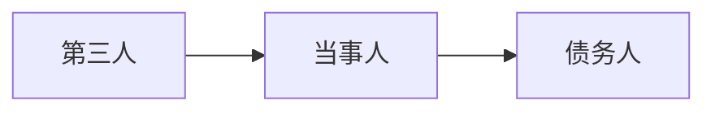

# 经济法

[TOC]

## 1 考试内容

### 1.1 案例题（3道35分）

分布：两道合同编，一道合伙企业法

### 1.2 简答题（3道30分）

分布：合同编，公司法，知识产权保护法

### 1.3 单选题（10道20分）

分布：反垄断法、民法典合同编、专利法、反不当竞争法、公司法都有

### 1.4 多选题（5道15分）

分布：一个反垄断；两个合同法（救济措施）；两个公司法（公司设立、出资）

### 1.5 其他说明

新公司法：有限责任，不考组织机构，考设立要求、责任、权利

语录：有两道案例题是合同编的内容，其中有一个案例题，没那么细，四问，不揪细节，把握大的方向，另一道，考的比较细致，合同的订立过程，要约邀请，发出要约、另一个承诺，三个之间的关系，合同订立，不按照就是违约，需要关注，违约，第一个了解什么情况构成违约，第二个构成违约后的救济措施。还有一个案例是合伙企业法，考察的不是很细；简答题三十分，合同编、公司法、知识产权保护法；提醒大家注意公司法的内容，注意是新公司法，一定要看法律原文，要看什么，讲的不多，比如有限责任公司和股份有限公司的设立条件、股东责任权利，组织机构不考；每一年拉开差距的都是在选择题，后面答得都不错，允许查卷。

## 2 合同编

### 2.1 合同的订立

#### 2.1.1 要约

姓名、标的、数量

生效时间：相对人知道

要约的撤回需要要约未生效

要约的撤销需要在受要约人作出承诺前为其所知道。但是要约人明确承诺期限、其他形式表明要约不可撤销的，受要约人有理由认为不可撤销并做了准备的除外

要约失效：被拒绝、被撤销、未作出承诺、实质性变更

要约的承诺期限：载明的以载明的，没有的以邮戳起算；快速通讯，到达受要约人起算

承诺生效合同成立，生效时间同要约。不需要通知的，作出即生效

受要约人做出实质性变更的为新要约。非实质性变更除非要约人及时表示反对或者明确规定不能改，视为有效

一方已经履行主要义务，对方接受时，该合同成立

格式条款权利义务不对等的无效

格式条款争议，按照常理解释。多种解释的，作出不利于提供格式条款一方的责任

### 2.2 合同的履行

政府指导定价的，逾期交付，价格上涨按照原价格执行，价格下降按照新价格执行

连带债务人实际承担超出自己份额的部分，可以向其他债务人追偿。其他债务人的抗辩权也因此可以向该债务人主张，并且被追偿的债务人不能履行的，其他债务人也应当连带

部分连带债务人履行之类的，其他债权人的债务在相应范围内消灭；部分连带债务人的债务被免除的，其他债务人对债权人的债务在该连带债务人应当承担的份额范围内消灭；部分连带债务人的债务与债权人的债权同归于一人的，就是混同，视为债务被免除；债权人对部分连带债务人的肌肤受领迟延的，对其他连带债务人发生效力

连带债权人，应当按比例向其他连带债权人返还

**债权人作为当事人：**

当事人约定债务人向第三人履行债务，未，向债权人承担违约责任

> 这里好像是视作当事人与债务人的新的法律关系

当事人约定第三人可以直接请求债务人向其履行债务，第三人未在合理期限拒绝，未，第三人可以请求债务人承担违约责任，债务人对债权人的抗辩，可以向第三人主张

> 这里是在原关系的基础上增补，将权利代给第三人

**债务人作为当事人：**

当事人约定由第三人向债权人履行债务，未，债务人应当向债权人承担违约

> 都是对债务人严格要求

债务人不履行的，第三人可以代为履行，履行后，对债务人的债权转移给第三人

> 这里实际上第三人是当事人

**互负债务的情况：**

1. **同时履行抗辩权：**没有先后顺序的，应当同时。在对方先履行前，有权拒绝履行请求。对方不符合约定，有权拒绝

2. **先履行抗辩权：**又先后顺序的，债务先履行，否则有权拒绝。先履行不符合约定的，有权拒绝

3. **不安抗辩权：**应当先履行的，有确切证据的，可以中止。经营状况恶化，转移资产、抽逃资金、以逃避债务，丧失商业信誉，有丧失或者可能丧失履行债务能力的其他情形

   如果没有确切证据的，应当承担违约责任。及时通知对方，对方提供担保，恢复履行。对方不，可解除合同并要求对方承担违约责任

债权人可以拒绝债务人提前履行、部分履行，前提是不损害债权人

情势变更，导致显失公平，可以重新协商。协商不成的，可以请求人民法院变更或解除合同

### 2.3 合同的保全

债权人可以向人民法院请求以自己的名义代位行使债务人对相对人的权利，属于其自身的除外。行使范围以债权人的到期债权为限，必要费用由债务人负担。相对人对债务人的抗辩，可以向债权人主张

债权人债权到期前，债务人的债权存在诉讼时效期间即将届满或者未及时申报破产债权等，影响了债权人债权实现，债权人可以代位

代位权成立，债务人的相对人履行，债权人接受，债权人债务人之间、债务人相对人之间相应的权利义务终止

债务人放弃债权、无偿转让、延期等恶意，影响债权人债权实现的，可请求人民法院撤销。低价转让、高价受让、提供担保也可以。撤销权一年，实际上同法律基础所述。

### 2.3 合同的变更和转让

当事人约定非金钱债权不得转让的，不得对抗善意第三人；金钱债权不得转让的，不得对抗第三人

债权人转让债权，未通知债务人的，该转让对债务人不发生效力。债权转让通知不得撤销，除非受让人同意

债务人接到债权转让通知后，债务人对让与人的抗辩，可以向受让人主张

债权转让中的**债务抵消情形：**

债务人可以向受让人主张抵销

1. 债务人对让与人享有债权，且债务人的债权先于或同时
2. 债务人的债务与转让的债权是基于同一合同产生的

债务转让情形：

债务人将债务转让给第三人，应当经债权人同意。债权人未作表示视为不同意

第三人加入债务，与债务人共担债务，债权人未拒绝的视为同意。第三人在其愿意的范围内，连带责任

债务转移了的，新债务人可以主张原抗辩权。原债务人对债权人的债权，新债务人不得主张抵销

### 2.4 合同的权利义务终止

债务人对同一债权人负担多项，不足以清偿的，由债务人指定其履行的债务为。未指定的，优先到期的、优先没担保的、优先负担较重的、按照到期时间先后、按照债务比例。主债务外的还应当支付其他的的，实现费用、利息、主债务

解除合同条件：法定解除

1. 不可抗力致使合同目的不能实现
2. 履行期届满前，当事人一方明确表示或者以自己的行为表明不履行主要债务
3. 当事人一方迟延履行主要债务，经催告后在合理期限内仍未旅行
4. 当事人一方迟延履行债务或者有其他违约行为致使合同目的不能实现的
5. 法律规定的其他情形
6. 什么持续履行的不定期合同

没有约定解除权行使期限的，自知道或应当，一年内不行使消灭，或对方催告后合理期限内

当事人一方依法主张解除合同的，应当通知对方。合同自通知到达对方时解除。未通知对方，可以直接提起诉讼或申请仲裁，确认该主张的，合同自起诉状副本或仲裁申请副本送达对方时解除

合同解除后：尚未履行的，终止履行；已经履行的，视情况，当事人可以请求恢复原状或者采取其他补救措施，并有权请求赔偿损失

互负债务的抵销

提存

### 2.5 违约责任

违约责任的承担方式：继续履行、补救措施、赔偿损失

金钱债务，可以请求支付

非金钱债务可以请求继续履行，但法或事实上不能履行、不适用强制或费用过高、债权人合理期限未请求的除外

就迟延履行约定违约金的，违约方支付违约金后，还应当履行债务

定金不得超过20%

因不可抗力不能履行的，应当及时通知对方，并提供证明

看CPA-P117

## 3 合伙企业法

普通合伙人承担无限连带责任，有限合伙人以其认缴的出资额为限

### 3.1 普通合伙企业

国有独资企业、国有企业、上市公司以及公益性的事业单位、社会团体不得成为普通合伙人；行政法规禁止从事营利性活动的人：通过国家公务员考试的人员、党政机关领导、警官、法官、检察官

合伙人在企业清算前私自转移企业财产的，企业不得对抗善意第三人

合伙人之间转让应当通知其他合伙人

对外转让，同等条件下，其他合伙人有优先购买权

以合伙企业中的财产份额出质，未经一致同意的，行为无效，给善意第三人的损失，行为人承担

合伙人的限制：

1. 不得与本合伙企业相竞争的业务
2. 除非另有约定或一致同意，否则，不得与本企业进行交易
3. 不得从事损害本合伙企业利益的活动

损益分配顺序：按照合伙协议约定$\to$合伙人协商$\to$按实缴出资比例分配、分担$\to$平均。不得将全部利润分配给部分合伙人或者由部分合伙人承担全部亏损

合伙企业对合伙人执行合伙事务以及对外代表合伙企业权利的限制，不得对抗善意第三人

合伙人的个人债务：

1. 相关债权人不得以其债权抵销其对合伙企业的债务，也不得代位行使合伙人在合伙企业中的权利
2. 合伙人可以以其从合伙企业取得的收益用于清偿；债权人可以请求法院强制执行该合伙人在合伙企业中的财产份额用于清偿
3. 人民法院强制执行时，应当通知全体合伙人，其他合伙人有优先购买权；其他合伙人不购买，又不同一转让的，退伙或者削减财产份额

入伙：

1. 新合伙人对入伙前债务承担无限连带责任

退伙：

1. 自愿退伙

   > 协议退伙：有合伙期限，其他合伙人严重违反合伙协议约定的义务以及其他一般的理由；
   >
   > 通知退伙：未约定合伙期限，不造成不利影响，提前30日通知其他合伙人

2. 法定退伙

   > 当然退伙：死亡；丧失个人偿债能力；法人被吊销；协议约定；被强制执行；成为无或限制民事行为能力人
   >
   > 除名：未履行出资义务；故意重大过失损失；不正当行为；约定的是由

退伙的效果：

1. 财产继承

   > 我认为跟新合伙人入伙差不多。不用转让好像，不愿意就退还了

2. 退伙结算：退还财产份额、扣除赔偿份额、分担亏损份额

3. 连带责任：退伙前的承担无限连带责任

特殊的普通合伙企业：

​    故意重大过失原因的个人无限连带责任，其他人以财产份额为限，有限责任

​    非的一同承担无限连带责任

### 3.2 有限合伙企业

五十个以下，至少一个普通

不得以劳务出资；补缴义务，违约责任

有限合伙人不执行合伙事务，不得对外代表有限合伙企业

有限合伙企业不得将全部利润分配给部分合伙人，另有约定的除外

有限合伙人可以同本企业进行交易，也可以相竞争，另有约定的除外

有限合伙人可以出质，另有约定的除外

有限合伙人向其他人转让的，提前三十天通知其他合伙人

第三人有理由相信有限合伙人为普通合伙人并与之交易的，该笔交易承担与普通合伙人同样的责任。造成损失的，有限合伙人应当承担赔偿损失

新入伙的有限合伙人，对以前的债务以其认缴出资额为限

有限合伙人退伙后，以其从企业取回的财产承担责任

普通$\to$有限，或者反过来要一致同意

有限$\to$普通，对其作为有限合伙人期间的债务承担无限连带责任

普通$\to$有限，前承担无限连带责任

清偿顺序：清算费$\to$职工工资$\to$社保、法定补偿金$\to$清缴所欠税款$\to$清偿债务，余额按照损益分配

### 3.3 综合

#### 3.3.1 非执行事务合伙人的权利

1. 非货币性资产出资的估价，一致同意

2. 合伙人向合伙人以外的人转让其在合伙企业中的财产份额时，一致同意

3. 以合伙企业中的财产份额出质，一致同意

4. 监督执行事务合伙人执行合伙事务情况

5. 合伙事务决议中的投票权

6. 除另有约定外，一致同意的事项

   > 1. 改变合伙企业的名称
   > 2. 改变合伙企业的经营范围、主要经营场所的地点
   > 3. 处分合伙企业的不动产
   > 4. 转让或者处分合伙企业的知识产权和其他财产权利
   > 5. 以合伙企业名义为他人提供担保
   > 6. 聘任合伙人以外的人担任合伙企业的经营管理人员

7. 合伙人与本合伙企业进行交易

8. 入伙、约定合伙期限的退伙

9. 转为有限合伙企业

10. 查阅账簿等财务资料的权利

11. 提出异议的权利和撤销委托的权利

12. 财产继承，一致同意

13. 经营管理提出建议

14. 

## 4 公司法

### 4.1 股东权利

1. 表决权
2. 选举权与被选举权
3. 依法转让股权或股份的权利
4. 知情权
5. 建议和质询权
6. 出资优先权
7. 股利分配请求权
8. 提议召开临时股东会和自行召集的权利
9. 临时提案权
10. 异议股东股份回购请求权
11. 申请法院解散公司的权利
12. 公司剩余财产分配请求权
13. 股东代表诉讼
14. 股东直接诉讼

### 4.2 股东义务

1. 出资义务
2. 善意行使股权的义务
3. 

### 4.3 设立条件

股份有限公司：

1. 发起人条件：1人以上200人以下，其中半数以上在境内有住所；发起人承担公司筹办事物，应当签订协议，明确各自在公司设立过程中的权利和义务。
2. 财产条件：发起人和认股人依法认购股份、缴纳出资。
3. 组织条件：公司名称、住所、章程以及已发简历的组织机构等。制定公司章程

有限责任公司：

1. 股东条件：50个一下股东出资设立，允许设立1人有限责任公司
2. 财产条件：五年内缴足
3. 组织条件：

## 5 其他法律

### 5.1 反不当竞争法

法律责任不考

赔偿顺序：按照被侵权所受到的实际损失$\to$侵权所获得的利益$\to$500万元以下。情节严重的可以前两个的1-5倍

不正当行为：

1. 禁止混淆行为
2. 禁止商业贿赂
3. 禁止虚假宣传
4. 禁止侵犯商业秘密
5. 有奖销售
6. 禁止商业诋毁
7. 网络领域不正当竞争行为规制

### 5.2 反垄断法

说过是考选择题？重点是滥用市场支配地位

#### 5.2.1 滥用市场支配地位

先判断是否有市场支配地位，再判断是否利用市场控制力

主要形态：

1. 强制交易

2. 搭售和附加不合理交易条件的

   > 构成要件可能考判断

3. 掠夺性定价：低于成本价

4. 差别对待

#### 5.2.2 联合限制竞争

固定价格、限制产量、划分市场

主体、主观、客观、后果

水平协议、垂直协议

#### 5.2.3 经营者集中

#### 5.2.4 行政性垄断

强制交易、市场准入

### 5.3 法律基础

#### 5.3.1 无效民事法律行为

有效要件：

1. 实质性有效要件

   > + 民事行为能力
   > + 意思表示真实
   > + 不违反法律或社会公共利益

2. 形式有效要件

   > 书面形式、口头形式或者其他形式

无效民事法律行为类型：

​     无效民事法律行为，是指已经成立，但欠缺民事法律行为的有效要件，行为人的设立、变更和终止权利、义务的内容不发生法律效力的行为。

1. 无民事行为能力人实施的和限制行为能力人实施的依法不能独立实施的单方行为；
2. 一方以**欺诈**、**胁迫**手段或者**乘人之危**情况下所为的损害国家利益的民事法律行为；
3. 恶意串通，损害国家、集体或第三人利益的民事法律行为；
4. 合法形式掩盖非法目的的行为；
5. 损害社会公共利益的行为；
6. 违反法律、行政法规的强制性规定的行为。

后果：

​    自行为开始时起即 没有法律效力。但无效民事法律行为仍会发生一定法律后果。

1. 返还财产
2. 赔偿损失
3. 收缴财产归国家或集体所有，或者返还财产给第三人

#### 5.3.2 可撤销的民事法律行为

​    因行为有法定的重大瑕疵而须以诉撤 销的民事行为

类型：

1. 重大误解

2. 显失公平

3. 趁人之危

4. 欺诈、胁迫

   > 后两个损害国家利益就是无效民事法律行为

效果：

1. 撤销权，形成权、以诉为之
2. 除斥期间，知道撤销事由一年内，发生之日五年内
3. 被撤销后，自始无效

#### 5.3.3 代理行为

  代理人在代理权限内以被代理人的 名义实施民事法律行为。被代理人对代理人的代理行为承担民事责任。代理是代理人在代理权限内，以被代理 人名义与第三人实施法律行为，由此产生的 法律后果直接归属于被代理人的法律制度。

不能代理的：

1. 违法行为

2. 事实行为

   > 民法把行为分为事实行为和法律行为。事实行为，是指行为人不具有设立、变更或消灭民事法律关系的意图，但依照法律的规定能引起民事法律后果的行为。

3. 身份行为，离婚、结婚、遗嘱

4. 按照双方约定

代理种类：

1. 委托代理
2. 法定代理
3. 指定代理

滥用代理权：

1. 自己代理
2. 双方代理
3. 与第三人恶意串通

无权代理效力：

1. 本人是否追认

2. 第三人催告权和撤销权

   > 催告后，一个月内是否追人

无权代理责任：

1. 行为人对本人的责任

   > 本人拒绝追认，侵权，承担侵权责任，赔偿损失

2. 行为人对第三人的责任

   > 本人拒绝追认，第三人未撤销。内容合法，第三人善意，承担履行义务或者承担赔偿损失

3. 第三人对本人的责任

   > 第三人非善意，是对本人的共同侵权，与行为人承担连带责任

无权代理情形：

1. 没有代理权而为代理行为
2. 超越代理权而为代理行为
3. 代理权终止后而为代理行为

#### 5.3.4 表见代理

​    行为人无代理权，由于本人的行为足以使善意第三人有理由确信其有代理权并与之实施法律行为，从而由**本人承担授权责任**的无权代理。

构成要件：

  一般条件：

1. 具备代理的表面特征
2. 行为人没有代理权
3. 法律行为的一般有效要件

  特殊要件：

1. 第三人有理由确信行为人有代理权
2. 确信是由于有本人过失的原因所致
3. 第三人基于主观善意与行为人实施法律行为

本人承担行为有效责任

#### 5.3.5 诉讼时效

普通诉讼时效期间：3年

从权利人知道或者应当知道权利被侵害时起算。但是从权利被侵害之日起超过20年的，不予保护

诉讼时效期间中止：在诉讼时效期间进行的最后6个月内，因不可抗力或其他障碍致使权利人不能行使请求权的，暂停计算，事由结束继续计算，自中止时效的原因消除之日起满六个月，诉讼时效期间届满

诉讼时效期间中断：时效期间统归无效，中断事由消除后，诉讼时效期间重新计算。如权利人向义务人提出履行请求，义务人同意履行义务，提起诉讼等

不适用诉讼时效的情形

诉讼时效期间届满，义务人可以提出不履行抗辩。义务人同意履行的，不得以此抗辩。自愿履行的，不得请求返还

抗击对方，提出辩解与说明

## 6 知识产权法

